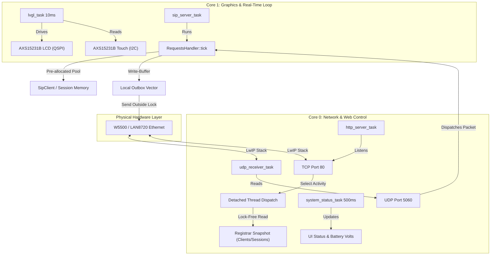

# Drawbridge Firmware: Deep Architectural Review

This document provides a highly technical, deep architectural analysis of the **Drawbridge** firmware (an ENGAGE product, distributed under a commercial license — see `LICENSE` and `THIRD_PARTY_NOTICES.md`; formerly known as *pocket-dial*, a name that survives in compile defines such as `POCKETDIAL_*`). It reviews the post-refactor system topology, multi-core scheduling paradigm, component communication boundaries, select-based HTTP thread dispatching model, the WAN trunk anchor, and concurrency optimizations.

---

## 1. System Topology & Component Overview

**Drawbridge** is an ultra-low-latency, dual-core SIP registrar and proxy server designed to run on resource-constrained ESP32 and ESP32-S3 microcontrollers (and as a host binary for development/CI). It supports multiple networking interfaces (Wi-Fi SoftAP/Station and SPI/RMII wired Ethernet) and drives smart displays (e.g., JC3248W535) using the LVGL graphics library.

The firmware architecture is divided into four core logical layers:
1. **Network Hardware & Driver Layer**: Controls physical media (Wi-Fi radio, W5500 SPI Ethernet MAC/PHY, LAN8720 RMII PHY) and registers low-level event handlers.
2. **Signaling & State Engine Layer (`RequestsHandler`)**: A lightweight RFC 3261-compliant SIP registrar and session controller managing client registration leases, active SIP sessions, and intercom broadcasting/paging features.
3. **WAN Trunk Anchor Layer (`AnchorClient` / `MediaBridge`)**: An optional outbound trunk that bridges LAN handsets to a commercial softswitch / CPaaS fabric over its HTTPS call-control API, with on-device µ-law⇄PCM16 media bridging (see §6).
4. **User Interface & Query Layer**: A custom select-based, thread-dispatching `HttpServer` serving a retro CGA CRT web dashboard, an mDNS service responder, a high-frequency LVGL-based GUI display task, and a **sysop terminal TUI** over SSH (wolfSSH on display, littlessh on eth/wifi/lan8720 — see §7).



---

## 2. Core Task Topology & Affinity Splits

To prevent render frame drops and network packet loss, **Drawbridge** enforces a strict core affinity split that isolates real-time communication tasks from CPU-intensive graphics rendering.

The system assigns FreeRTOS tasks to specific cores using `xTaskCreatePinnedToCore`:

### Core Affinity Allocation Table

| Task Name | Priority | Core Target (Display) | Core Target (Headless ETH) | Stack Size | Description |
| :--- | :---: | :---: | :---: | :---: | :--- |
| `lvgl_task` | 5 | **Core 1** | *N/A* | 8192 Bytes | Runs the LVGL render loop (`lv_timer_handler()`) every 10ms. Must have exclusive Core 1 access to avoid micro-stuttering. |
| `sip_server_task` | 5 | **Core 0** | **Core 1** | 8192 Bytes | Ticks the SIP state engine (`RequestsHandler::tick()`) and sweeps expired leases. |
| `udp_receiver_task` | 5 | **Core 0** | **Core 1** | 8192 Bytes | Listens on UDP port 5060, parses incoming packet headers, and dispatches them to the handler. |
| `http_server_task` | 4 | **Core 0** | **Core 0** | 8192 Bytes | Runs the select-based HTTP server accept loop. Spawns detached client worker threads. |
| `status_task` | 3 | **Core 0** | *N/A* | 4096 Bytes | Polls ADC battery voltage divider (GPIO 5) and updates on-screen status fields every 500ms. |

> [!IMPORTANT]
> **Task Isolation Design**:
> On the smart-display target (JC3248W535), **Core 1** is reserved exclusively for the `lvgl_task` to guarantee 60 FPS UI rendering. All network handling, SIP processing, and HTTP worker threads are pinned to **Core 0**. 
> For headless Ethernet/PoE builds, the high-priority `sip_server_task` and `udp_receiver_task` are shifted to **Core 1**, leaving **Core 0** to handle lower-priority HTTP/TCP traffic and background tasks.

---

## 3. Concurrency Architecture & Contention Mitigation

High-frequency HTTP polling of the CGA dashboard under production loads can introduce severe lock contention, resulting in UDP packet dropouts. The post-refactor codebase implements three critical architectural patterns to mitigate concurrency bottlenecks.

### A. Snapshotted Registrar Query Model (Issue #48)
Historically, the `HttpServer` queried `RequestsHandler` active client and session collections by directly acquiring the central `_mutex`. This blocked the real-time SIP signaling loop during active JSON generation.

The post-refactor architecture decouples the HTTP control plane from the UDP signaling plane using a **double-buffered snapshot model**:

1. **State Mutation (Real-Time Path)**: The main SIP signaling engine processes packets and ticks on a dedicated thread, acquiring `_mutex` only during rapid internal state changes.
2. **Snapshot Generation**: At the end of each periodic tick inside `RequestsHandler::tick()`, the engine constructs a lightweight `RegistrarSnapshot` (`_snapshot`) containing plain STL vectors of active registration strings and call metadata. This is committed to a secondary buffer under a dedicated, short-lived `_snapshotMutex`.
3. **Lock-Free Read (HTTP Path)**: When the `HttpServer` handles a GET request to `/api/status`, it queries `getActiveClients()` and `getActiveSessions()`. These methods acquire only the lightweight `_snapshotMutex` for a fraction of a microsecond to copy the snapshot, completely eliminating lock contention with the active signaling loop.

```
[UDP Receiver Thread]               [RequestsHandler State]              [HTTP Server Thread]
         │                                     │                                  │
         ├─────── Mutate State ───────────────>│                                  │
         │   (Acquires & releases _mutex)      │                                  │
         │                                     │                                  │
         │                                     ├── Update Snapshot ──┐            │
         │                                     │   (Once per second) │            │
         │                                     │<────────────────────┘            │
         │                                     │ (Acquires _snapshotMutex)        │
         │                                     │                                  │
         │                                     │<─────────── GET /api/status ─────┤
         │                                     │    (Acquires _snapshotMutex)     │
         │                                     │                                  │
```

### B. Out-of-Lock Socket Syscalls (Issue #51)
Executing slow blocking socket syscalls (like `sendto`) while holding the internal registrar lock created significant latency spikes. 

The refactored `RequestsHandler::handle` utilizes an **Outbox Pattern**:
* When processing an incoming SIP request, any generated responses or call-forwarding invites are temporarily accumulated inside a local `_outbox` vector (`std::vector<std::pair<sockaddr_in, std::shared_ptr<SipMessage>>>`).
* The central `_mutex` is released immediately after the state machine logic completes.
* Once the critical section is exited, the thread iterates through the local outbox and executes the UDP `sendto` syscalls outside the lock, keeping registrar lock hold times at microsecond-scale.

### C. Static Memory Pools (Issue #53)
Dynamic heap allocations (`new`, `malloc`, `make_shared`) within the hot UDP signaling path are a major cause of memory fragmentation and non-deterministic jitter on embedded targets.

The post-refactor signaling engine implements **static memory pre-allocation**:
* During initialization, `RequestsHandler` pre-allocates contiguous arrays of `SipClient` and `Session` smart pointers inside the constructor. Pool depths are compile-time knobs in `src/SIP/PoolConfig.hpp` (`POCKETDIAL_MAX_CLIENTS`, default 32; `POCKETDIAL_MAX_SESSIONS`, default 8; plus a `SipMessage` scratch pool and a beep-dialog pool), all overridable from the build command line.
* In steady-state operation, `allocateClient` and `allocateSession` search these pre-allocated pools to recycle unused objects, entirely bypassing the runtime heap.
* If the pool is exhausted under heavy load, the server automatically evicts the oldest expired client registration lease or returns `503 Service Unavailable`, protecting the core heap from out-of-memory (OOM) silent panics.

---

## 4. Select-Based HTTP Server Thread Dispatch Model

To prevent slow-client TCP connections from stalling the main HTTP accept thread, the `HttpServer` employs a select-monitored, multi-threaded worker dispatch model.

```
       [Main HTTP Server Thread]
                   │
         [select() on listen_sock]
                   │
           (Activity Detected)
                   │
         [accept() client socket]
                   │
       ┌───────────┴───────────┐
       ▼                       ▼
 [Spawn std::thread]     [Resume select()]
       │
 [Set SO_RCVTIMEO (5s)]
       │
 [Read body (Max 16KB)]
       │
 [Validate Same-Origin]
       │
 [Send HTTP Response]
       │
  [Close Socket]
```

### Accept Loop Implementation
1. The main HTTP accept loop uses `select()` on the listening socket with a `250ms` timeout to periodically yield execution and verify if the server is still running.
2. Upon activity, `accept()` is called to retrieve the client socket.
3. The server immediately dispatches client processing to a detached thread context (`std::thread([this, clientSock]() { handleClient(clientSock); }).detach()`), instantly freeing the accept thread to monitor subsequent connections.

### Worker Protection & Robustness (Issue #23)
* **Slowloris Protection**: The worker thread sets a strict 5-second socket receive timeout (`SO_RCVTIMEO`) using `setsockopt` to terminate slow-sending or dead TCP connections.
* **Heap Stack-Safety**: Rather than allocating a raw stack-local character buffer (which would overflow the tiny standard `pthread` thread stack on ESP32), the worker utilizes a heap-allocated `std::vector<char>` read buffer.
* **Buffer Overflow Cap**: The worker parses the `Content-Length` header and enforces a maximum payload limit of **16 KB** (16,384 bytes). If a client attempts to upload a larger body (e.g., in a malicious POST flood to `/api/wifi/connect`), the worker immediately responds with `413 Payload Too Large` and aborts the connection, securing the target's RAM.

---

## 5. Security & Network Protections

### Same-Origin Policy & CSRF Prevention (Issue #28 / #38)
Because the device serves as a local captive portal or open access point, malicious scripts running in background browser tabs on connected clients could attempt to trigger administrative side-effects (such as disconnecting users or reconfiguring Wi-Fi).

To prevent Cross-Site Request Forgery (CSRF), the server implements a robust **Same-Origin Check** inside `HttpServer::isSameOrigin`:
* If an incoming state-mutating POST request (`/api/kill`, `/api/wifi/connect`, `/api/wifi/mode_ap`) contains an `Origin` header (sent by modern browsers during cross-site requests), the server extracts the host domain.
* The server compares the `Origin` host string directly with the `Host` header sent by the client.
* If they do not match, the request is immediately rejected with `403 Forbidden` (`{"error":"cross-origin request rejected"}`).
* No wildcard `Access-Control-Allow-Origin: *` headers are ever returned on API routes, preventing cross-origin browser reads of active registration profiles.

### Per-Source-IP Token Bucket Rate Limiting (Issue #38)
To protect the registrar from UDP flood denial-of-service (DoS) attacks, the `RequestsHandler` integrates a thread-safe token bucket rate limiter:
* **Sustained/Burst Thresholds**: UDP packets are evaluated using a per-source IP token bucket with a default burst depth of **40 packets** and a sustained replenishment rate of **20 packets per second**.
* **Zero CPU Parse Overheads**: Rate check verification is executed before any SIP header parsing, dynamic routing, or database work. If an IP exceeds its burst threshold, the packet is instantly discarded, and the atomic `_packetsDropped` counter is incremented.
* **Eviction Cycle**: To prevent memory leak accumulation from transient spoofed IPs, inactive buckets are periodically evicted during the central registrar sweep.
* **Subnet CIDR Filtering**: If compiled with `-DPOCKETDIAL_ALLOW_CIDR="192.168.1.0/24"`, the registrar translates incoming IP addresses and blocks any traffic originating from outside the designated local network segment.

---

## 6. WAN Trunk Anchor & Media Bridge

Drawbridge can place outbound calls beyond the LAN by anchoring a leg on an upstream **commercial softswitch / CPaaS fabric** via its HTTPS call-control API (kept vendor-neutral here per the project's documentation discretion policy). The trunk is abstracted behind the `AnchorClient` interface (`src/SIP/AnchorClient.hpp`): `init`/`start`/`stop`, `makeCall`/`dropCall`, a control-event callback (`Ringing`/`Answered`/`Dropped`/`Dtmf`), and a bidirectional PCM16 audio API (`writeAudio` upstream, `registerAudioRxCallback` downstream). Two implementations exist: the production ESP-IDF client (real mTLS/WSS/HTTPS, in `src/SIP/`) and `LoopbackAnchorClient` (a host-testable echo double, selectable at runtime).

### Control plane
* **Persistent control-plane TLS connection**: `makeCall` / participant-drop commands run over a single keep-alive HTTPS connection (`_ctrlClient`, guarded by `_ctrlMutex`) that is pre-warmed at boot/reconnect (`warmCtrlConnection()`) and repaired/retried once on a stale socket (`performCtrl`). Each call-control command therefore costs one RTT instead of a fresh mbedTLS handshake.
* **WebSocket event channel**: call-state events arrive over a WSS connection derived from the configured base URL; the event handler runs on the WebSocket event task, so responses it generates are staged into `RequestsHandler::_asyncOutbox` (never the per-request `_outbox`, which is cleared at the start of every `handle()`).
* **OAuth token rules**: token lifetime is derived from the JWT's own `exp`/`iat` claims against the monotonic timer (no SNTP dependency) — *not* from the OAuth `expires_in` field, which the upstream reports incorrectly (60 s vs. the JWT's ~1 h validity). Refresh triggers within a 5-minute margin of expiry but is **deferred while media streams are active**, because re-issuing a token invalidates the one the open chunked streams hold mid-call.

### Media plane
* **Ring-time-primed GET audio stream**: the downstream audio receiver task is spawned at the *Ringing* event (`startRxIfNeeded`), so its retry loop is already polling on a warm TLS connection when the leg connects — inbound audio opens roughly one RTT after answer instead of paying connect+handshake at answer time.
* **Chunked POST audio stream**: upstream audio is written through an `esp_http_client` opened with `write_len = -1` (IDF-managed `Transfer-Encoding: chunked` framing) and is terminated with a clean RFC 9112 last-chunk on teardown.
* **`MediaBridge` (`src/SIP/MediaBridge.cpp`)**: one active bridge at a time. The LAN handset's RTP µ-law is decoded to PCM16 and pushed to the anchor's POST stream; anchor PCM16 from the GET stream lands in a `PlayoutBuffer`, is µ-law-encoded, and is paced out to the handset by `RtpSender` (underruns yield G.711 comfort noise rather than wiping samples). The bridge's RTP receiver binds an ephemeral port that is advertised in the SDP answer.

### Dial plan integration (`RequestsHandler::onInvite`)
A leading **`9` is the explicit trunk-access prefix**: dialing `101` rings LAN extension 101, while `9101` strips the 9 and routes `101` out the WAN anchor — checked *before* the registrar lookup, so the prefix always means "go out the trunk" even if a local `9101` exists. As a legacy fallback, an **unregistered destination without the prefix still tries the trunk** when one is connected. Anchor-routed sessions are flagged via `Session::setAnchor(true)` / `Session::isAnchor()`, which steers the *Answered* (200 OK + `MediaBridge` start), *Dropped* (server BYE with the stored local To-tag, Issue #12), and BYE/CANCEL paths. The blocking anchor operations (`start`, `makeCall`, `dropCall`) run on detached worker tasks/threads, never on the SIP receive thread.

### Trunk configuration persistence
Trunk credentials (base URL, client ID, client secret, source DN, loopback flag) are persisted in NVS under the `"storage"` namespace with trunk-prefixed keys (kept ≤15 chars, the NVS key limit). `RequestsHandler::getTrunkConfig()` / `setTrunkConfig()` are mutex-guarded and back the SSH TUI's trunk screen; **changes apply on the next reboot** — the anchor client is constructed from NVS at startup (asynchronously, so the TLS token fetch never blocks the constructor).

---

## 7. SSH Sysop Terminal (TUI)

`src/Helpers/SshServer.cpp` is a backend-agnostic **façade** (singleton, NVS `ssh_enabled` gate, terminal-geometry/handler/netinfo plumbing) in front of **two interchangeable SSH backends** — exactly one linked per build, selected in `main/CMakeLists.txt`. Both serve TCP port 22 (the `POCKETDIAL_SSH_PORT` macro, shared via `SshServer.hpp`) on a **Core 0, priority 3** task — below the SIP tasks — and the façade stubs itself gracefully when neither is linked.

- **wolfSSH** (`POCKETDIAL_HAS_WOLFSSH`, the **display** build, and host via `-D PD_HOST_SSH=ON`): the wolfSSH session loop lives in `SshServer.cpp`; its accept loop self-retries and the TUI drive coalesces window-change resizes.
- **littlessh** (`POCKETDIAL_HAS_LITTLESSH`, the **eth / wifi / lan8720** builds): a from-scratch SSH-2.0 server in `components/littlessh` on the PSA Crypto API / mbedTLS (curve25519-sha256 · ecdsa-sha2-nistp256 · aes256-gcm), with the glue in `src/Helpers/SshServerLittlessh.cpp`. It serves one client at a time, drives the same TUI via `on_data`/`on_idle` callbacks (1 Hz live refresh), and shuts down **cooperatively** (`lssh_config_t::stop`, never `vTaskDelete`) because the SSH-disable toggle runs on the SSH task itself. It is started **before** the provisioning gate so a headless unit can be onboarded over SSH (auth is open until an admin PIN exists, then PIN-gated).

The terminal itself, `src/Helpers/Tui.cpp`, is a **transport-agnostic ANSI TUI engine**: it takes a `std::function` byte writer plus a `feed(bytes)` input path and has no wolfSSH dependency, so it is host-compilable and unit-tested (`tests/Tui_test.cpp`). `SshServer::runTuiSession` wires it to the SSH channel. Screens (banner → hub → System Monitor, Network, PBX Config, Security, Reports/CDR, About) read and mutate state exclusively through the existing thread-safe `RequestsHandler` snapshot getters and guarded mutators — never raw engine internals. All framed output is measured in display columns (`dispWidth`/`padCols`/`truncCols`), never bytes, to keep the 80×24 frame intact with multibyte UTF-8 glyphs.
