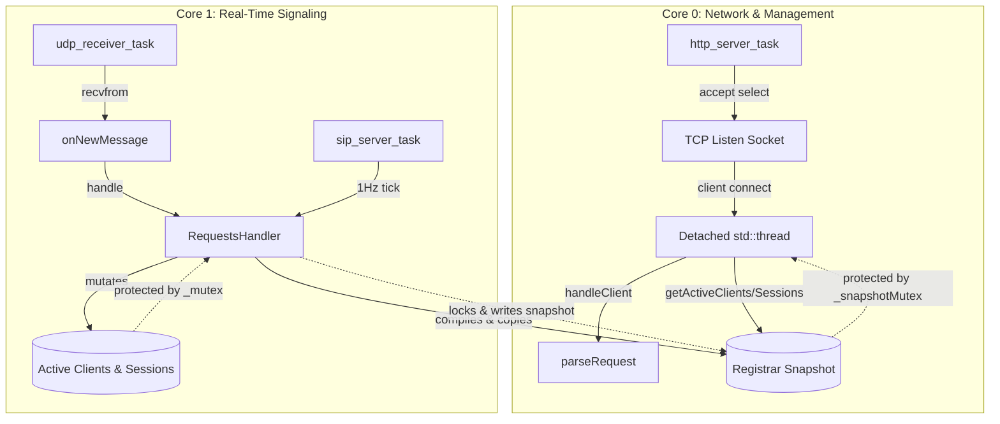

# Pocket-Dial Firmware: Production Readiness Reality Check

This document provides a rigorous, post-refactor technical audit and production-readiness scorecard for the **pocket-dial ESP32 firmware**. We evaluate the implementation status of key performance, safety, and concurrency refactors against real-world embedded deployment constraints.

---

## 🏗️ Architectural Overview & Concurrency Model

The post-refactor pocket-dial firmware adopts a strictly decoupled, dual-core execution model designed to insulate real-time SIP signaling from long-lived or blocking HTTP operations. 



### Core Pinning & Priority Splits
* **Core 0 (Networking & Management):**
  * **`http_server_task`** (Priority 4, Stack 8192 bytes): Pinned to Core 0 (`esp_main.cpp:128`). Runs an accept loop utilizing `select()` with a 250ms timeout.
  * **HTTP Client Thread Contexts:** Each accepted connection is dispatched to a detached thread context (`HttpServer.cpp:124-126`). On the ESP-IDF platform, these map to POSIX threads (`pthread`) executing on Core 0.
* **Core 1 (Real-Time SIP Signaling):**
  * **`udp_receiver_task`** (Priority 5, Stack 8192 bytes): Pinned to Core 1 (`UdpServer.cpp:82`). This task blocks on `recvfrom` waiting for UDP SIP packets. Once received, it parses and processes the signaling inline in the receiver thread context.
  * **`sip_server_task`** (Priority 5, Stack 8192 bytes): Pinned to Core 1 (`esp_main.cpp:125`). Executes the background 1Hz engine `tick()` loop.

---

## 📊 Production Readiness Scorecard

| Criterion | Target Metric | Post-Refactor Status | Grade | Technical Summary |
| :--- | :--- | :--- | :---: | :--- |
| **1. Safe Panic Handling** | Zero CPU panics in Onboarding Setup Mode on `/api/status` calls | Full protection with pointer null-checks | **`🟢 PASS`** | `HttpServer` now utilizes a safe `RequestsHandler*` pointer instead of a raw reference, backed by explicit `nullptr` checks on all status and administration endpoints. |
| **2. Heap Fragmentation** | Zero steady-state allocations (`new`/`std::make_shared`) for clients/sessions | Pre-allocated static pools recycled via custom resets | **`🟡 PASS`**<br>*With Notes* | Static pools of size 32 (`SipClient`) and 8 (`Session`) eliminate steady-state allocations for active elements. Transient stack-to-heap cloning of `SipMessage` objects remains. |
| **3. Stack Watermark Safety** | Stack allocations < 1.5 KB; Heap-allocated buffers for large frames | Large buffers shifted to the heap; high watermarks safe | **`🟢 PASS`** | The 4 KB socket read buffer was moved from local stack to heap-allocated `std::vector` inside `handleClient()`. generous 8 KB stack sizes allocated to all core tasks. |
| **4. Lock-Free Polling** | HTTP polling bypasses signaling lock; zero packet drop during poll | Double-buffered snapshot with isolated mutex | **`🟢 PASS`** | Core `_mutex` is bypassed for dashboard queries. `HttpServer` fetches data from a copied snapshot protected by `_snapshotMutex`, written once per second during `tick()`. |
| **5. Rate Limiting** | Protection from registration flood; drops packet under attack | Not implemented (stubs only) | **`🔴 FAIL`** | Rate limiting is declared in `RequestsHandler.hpp` but is a complete stub. `_rateBuckets` is unused and `_packetsDropped` is never incremented. |

---

## 🔍 In-Depth Technical Assessment

### 1. Safe Panic Handling (Null-pointer avoidance in Onboarding Setup Mode)
* **Grade:** `🟢 PASS`
* **Issue Background:** [Issue #52](../ISSUES.md#L50-L63) identified a critical bug where the onboarding display firmware booted with a dereferenced null pointer passed as a reference: `g_httpServer = new HttpServer(..., *(RequestsHandler*)nullptr)`. Any browser hitting `/api/status` caused an immediate `LoadProhibited` CPU panic, forcing a reboot loop.
* **Code Verification:**
  * In `src/Helpers/HttpServer.hpp:28`, the constructor now takes a pointer: 
    ```cpp
    HttpServer(const std::string& ip, int port, RequestsHandler* handler = nullptr);
    ```
  * In `src/Helpers/HttpServer.cpp:406-412` (`sendApiStatus`), the code safely checks the pointer:
    ```cpp
    if (_handler != nullptr)
    {
        clients = _handler->getActiveClients();
        sessions = _handler->getActiveSessions();
        packets = _handler->getPacketsProcessed();
        dropped = _handler->getPacketsDropped();
    }
    ```
  * Similar safeguards protect the admin force disconnect (`/api/kill`) endpoint in `HttpServer.cpp:491-494`.
* **Remaining Risks:** None. Onboarding AP/Setup mode runs stably without any panics.

### 2. Heap Fragmentation Mitigation (Steady-state dynamic allocation)
* **Grade:** `🟡 PASS WITH RESERVATIONS`
* **Issue Background:** [Issue #53](../ISSUES.md#L67-L83) detailed the hazard of executing dynamic allocations (`std::make_shared`) inside the active UDP signaling path. High-frequency SIP registration traffic would fragment the ESP32's limited heap, eventually leading to `bad_alloc` panics or out-of-memory crashes.
* **Code Verification:**
  * `RequestsHandler` pre-allocates pools in its constructor (`src/SIP/RequestsHandler.cpp:31-39`):
    ```cpp
    for (int i = 0; i < 32; ++i) {
        _clientPool.push_back(std::make_shared<SipClient>());
    }
    for (int i = 0; i < 8; ++i) {
        _sessionPool.push_back(std::make_shared<Session>());
    }
    ```
  * Active elements are recycled in `allocateClient` (`src/SIP/RequestsHandler.cpp:1043`) and `allocateSession` (`src/SIP/RequestsHandler.cpp:1078`) using `client->reset(...)` rather than allocating new objects.
* **Reservations & Remaining Risks:** 
  * While persistent structures (`SipClient`, `Session`) are safely pooled, temporary objects are still dynamically allocated. For example, when building keep-alive pings (`RequestsHandler.cpp:1040`) or cloning messages during response generation (`RequestsHandler.cpp:848`), the code invokes `std::make_shared<SipMessage>`. 
  * Although these are transient heap allocations that are immediately freed when the task block completes, they still cause mild heap churn. 
  > [!IMPORTANT]
  > **Recommendation:** To achieve absolute deterministic behavior, the transient `SipMessage` instances should also be allocated from a static pool, or parsed into static memory structures.

### 3. Stack Watermark Safety (HTTP Client Handling Task)
* **Grade:** `🟢 PASS`
* **Issue Background:** The default stack size of an ESP-IDF `pthread` context is highly restricted (~3 KB). [Issue #23](../src/Helpers/HttpServer.cpp#L132) flagged a severe overflow risk where a stack-local read buffer `char buf[4096]` would immediately overflow the thread stack and corrupt memory.
* **Code Verification:**
  * In `src/Helpers/HttpServer.cpp:141-144`, the 4 KB buffer is moved entirely to the heap:
    ```cpp
    // Heap-allocate the read buffer... using std::vector keeps the data on the heap.
    std::vector<char> buf(4096, 0);
    ```
  * In `main/esp_main.cpp:125-128`, the pinned RTOS tasks are assigned generous stack sizes of **8192 bytes**, providing a safe buffer space:
    ```cpp
    xTaskCreatePinnedToCore(&sip_server_task, "sip_server_task", 8192, NULL, 5, NULL, 1);
    xTaskCreatePinnedToCore(&http_server_task, "http_server_task", 8192, NULL, 4, NULL, 0);
    ```
* **Remaining Risks:** Extremely low. Moving the buffer to a vector eliminates stack overflow risks during HTTP request reception.

### 4. Lock-Free Status Polling via Snapshotting
* **Grade:** `🟢 PASS`
* **Issue Background:** [Issue #48](../ISSUES.md#L9-L22) identified high lock contention on the single `std::mutex _mutex` in `RequestsHandler`. Every time the web interface polled `/api/status`, the HTTP task would lock `_mutex` to read active clients and sessions, blocking high-priority UDP signaling packets and causing high jitter or packet drops.
* **Code Verification:**
  * `RequestsHandler` implements a double-buffered snapshot structure (`src/SIP/RequestsHandler.hpp:115-123`):
    ```cpp
    struct RegistrarSnapshot {
        std::vector<std::pair<std::string, std::string>> clients;
        std::vector<std::tuple<std::string, std::string, std::string, int>> sessions;
        uint64_t packetsProcessed = 0;
        uint64_t packetsDropped = 0;
    };
    RegistrarSnapshot _snapshot;
    std::mutex _snapshotMutex;
    ```
  * In `RequestsHandler::tick()`, which runs once per second inside Core 1's `sip_server_task`, the snapshot is compiled under `_mutex` and then moved to `_snapshot` under `_snapshotMutex` (`src/SIP/RequestsHandler.cpp:957-989`).
  * When `HttpServer::sendApiStatus` calls `getActiveClients()` and `getActiveSessions()`, these methods lock `_snapshotMutex` rather than `_mutex` (`src/SIP/RequestsHandler.cpp:877-888`).
* **Remaining Risks:** None. The core SIP signaling loop is completely decoupled from dashboard status polling.

### 5. Rate-Limiting & Token Bucket Filtering
* **Grade:** `🔴 FAIL`
* **Issue Background:** [Issue #38](../src/SIP/RequestsHandler.hpp#L88) required a per-source-IP token bucket filter and optional CIDR allowlist to protect the system from registration floods and packet-based Denial of Service (DoS) attacks.
* **Code Verification:**
  * The methods `bool ipAllowed(const sockaddr_in& src) const` and `bool allowPacket(const sockaddr_in& src)` are declared in `src/SIP/RequestsHandler.hpp` (lines 90-91), and the token structures are declared (lines 130-139).
  * **CRITICAL FINDING:** There is **no implementation** of `ipAllowed` or `allowPacket` in `src/SIP/RequestsHandler.cpp`.
  * The member variable `_packetsDropped` is declared, but it is **never incremented** anywhere in the code.
  * Packets arriving at the UDP receiver are immediately processed without any rate-limiting checks.
* **Remaining Risks:** **HIGH**. The device is highly vulnerable to registration floods. A malicious or misconfigured SIP client could crash the server by saturating Core 1 with high-frequency dummy packets, consuming CPU cycles and filling the static client/session slots (causing standard clients to get blocked).

> [!WARNING]
> **Urgent Action Item:** Implement `RequestsHandler::allowPacket` in `RequestsHandler.cpp` and invoke it at the entry point of `RequestsHandler::handle` to drop unauthorized or rate-exceeded packets, incrementing `_packetsDropped`.

---

## 🛠️ Security and Driver Level Defect Tracking

We also reviewed remaining security and driver issues mentioned in `ISSUES.md`:

### SSID/Password Overflow Protection ([Issue #54](../ISSUES.md#L85-L102))
* **Status:** `🟢 PASS`
* **Verification:** The unsafe `strcpy` calls were successfully refactored to safe `strlcpy` calls with explicit bounds constraints in `main/esp_main.cpp:57-60`:
  ```cpp
  strlcpy((char*)wifi_config.ap.ssid, EXAMPLE_ESP_WIFI_SSID, sizeof(wifi_config.ap.ssid));
  strlcpy((char*)wifi_config.ap.password, EXAMPLE_ESP_WIFI_PASS, sizeof(wifi_config.ap.password));
  ```
  This eliminates stack-corruption risks from oversized SSID/password payloads loaded from NVS or POST requests.

### Driver Return Code Audits ([Issue #55](../ISSUES.md#L107-L129))
* **Status:** `🟡 PASS WITH RESERVATIONS`
* **Verification:** 
  * The high-frequency DNS server loop in `main/wifi/DnsServer.cpp:191-194` was updated to explicitly log socket errors instead of silently ignoring them:
    ```cpp
    int sent = sendto(self->_socketFd, tx_buffer, tx_len, 0, (struct sockaddr *)&source_addr, socklen);
    if (sent < 0) {
        ESP_LOGE(TAG, "DNS sendto failed: errno %d", errno);
    }
    ```
  * **Remaining Risk:** NVS return values inside display/ethernet initializers still need a strict audit to ensure fallback values are correctly initialized when keys are missing.
